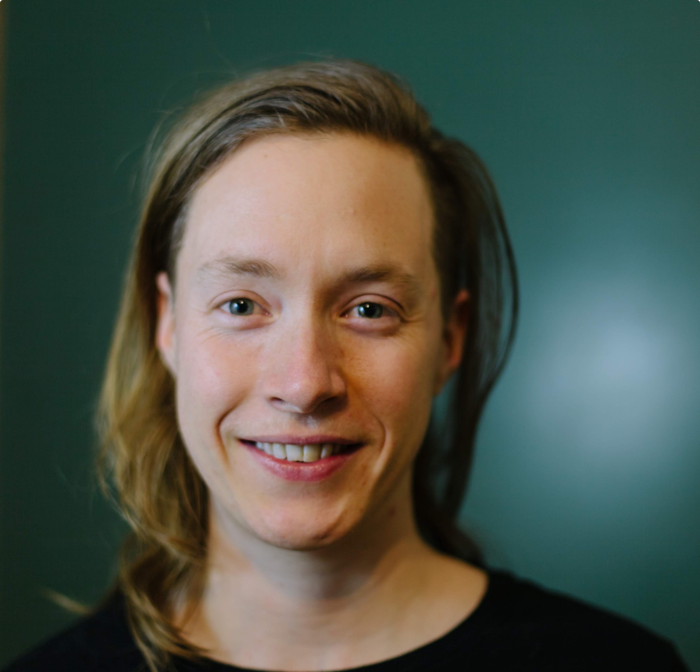

  

      <ul class="nav">
          <li><a href="{{ BASE_PATH }}/assets/cv-jean.pdf">cv</a></li>
          <li><a href="https://github.com/jean997">github</a></li>
      </ul>
  

<!--style> .equal-width td {   width: 50%; } </style--> 
<table class="wide">
<tr>
  <td class="left" width="50%">
	
   </td>
  <td class="left">
 I am a postdoc in the <a href="http://www.genes.uchicago.edu">Department of 
	Human Genetics</a>
   	at <a href="http://www.uchicago.edu">the University of Chicago</a>,
 	co-mentored by <a href="http://xinhelab.org">Xin He</a> and
	<a href="http://stephenslab.uchicago.edu">Matthew Stephens</a>.
   I recieved my Ph.D. in 2016 in Biostatistics from the <a href="https://www.biostat.washington.edu">University of Washington</a>
  	advised by <a href="http://www.faculty.washington.edu/nrsimon/">Noah Simon</a>.
  
    I develop statistical methods motivated by problems in genetics and genomics. Many of my current projects focus is on using genetic associations to understand causal and non-causal relationships between clinical traits (symptoms, diseases, etc), biomarkers, and -omic traits (like gene expression).  I am also interested in association testing for spatially structured data types, and more broadly, in robust and non-parametric statistical methods. 
   
  <a href = "https://scholar.google.com/citations?hl=en&user=r6fNZ6cAAAAJ">See my publications on Google Scholar</a>
  </td>

</tr>
</table>

  

	Email: <code>morrison.jeanv at gmail.com</code> 
  

