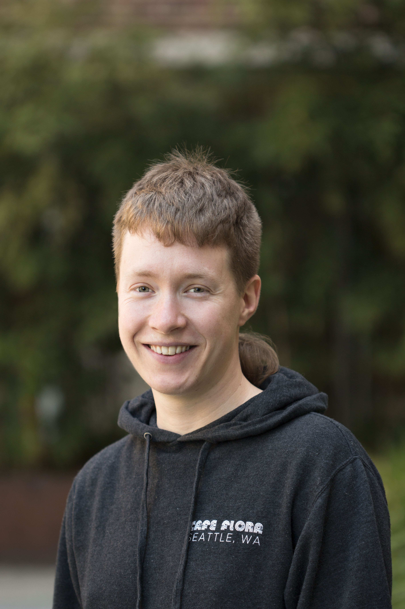

  

      <ul class="nav">
          <li><a href="{{ BASE_PATH }}/assets/cv-jean.pdf">cv</a></li>
          <li><a href="https://github.com/jean997">github</a></li>
      </ul>
  

<!--style> .equal-width td {   width: 50%; } </style--> 
<table class="wide">
<tr>
  <td class="left" width="50%">
	
   </td>
  <td class="left">
   <b> Jean Morrison</b>
   
    I am a postdoc in the <a href="http://www.genes.uchicago.edu">Department of 
	Human Genetics</a>
   	at <a href="http://www.uchicago.edu">the University of Chicago</a>,
 	co-mentored by <a href="http://xinhelab.org">Xin He</a> and
	<a href="http://stephenslab.uchicago.edu">Matthew Stephens</a>.
   
   My research generally involves using statistics to answer questions 
   that arise in human genetics. Applications I am particularly excited 
   about right now include gene regulation, testing associations with 
   spatially structured data tyepes, integrating GWAS and epigentic data, 
   and using summary statistics  from multiple GWAS to learn about the 
  relationships between phenotypes.
   
    I recieved my Ph.D. in Biostatistics from the <a href="https://www.biostat.washington.edu">University of Washington</a>
  	advised by <a href="http://www.faculty.washington.edu/nrsimon/">Noah Simon</a>.
  </td>

</tr>
</table>

  

	Email: <code>morrison.jeanv at gmail.com</code> 
  

