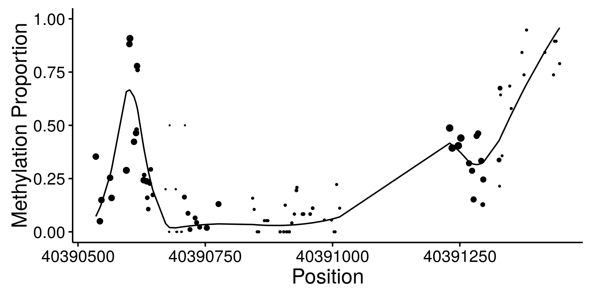

    

        <ul class="nav">
	    <li><a href="#cause"> Mendelian Randomization
            <li><a href="#smooth">Associations with Spatially Structured Data</a></li>
            <li><a href="#rcc">Confidence Intervals</a></li>
        </ul>
    

###  Mendelian Randomization

Mendelian randomization (MR) is an increasingly popular technique for inferring causal effects between traits that cannot be (or have not been) studied using randomized trials. MR is a variation of instrumental variable analysis in which genetic variants are used as instruments. MR is incredibly appealing because it promises information about causal effects using only summary genetic association data which is now publicly available for a cornucopia of traits. Unfortunately, the assumptions that MR makes about the variants used are quite strict, difficult to verify, and often violated. We developed a Bayesian approach to MR that is robust to a wider range of violations that existing methods. 

[Website:](https://jean997.github.io/cause/) Read a longer introduction and some software tutorials
[R-package](https://github.com/jean997/cause)
[Pre-Print](https://www.biorxiv.org/content/10.1101/682237v3)

### Assocations with spatially structured traits

Sequencing based assays used to measure epigenomic features tend to produce very dense spatially structured measurements like these bisulfite sequencing data from [ENCODE](https://www.encodeproject.org/):

We call data generated by these assays "genomic phenotypes".
Often we are interested in identifying regions of the genome where a genomic phenotype is associated with an experimental condition or an organismal level trait (like height). I've worked on two different approaches to this problem. 

In both of these projects, our motivations come from genomic data but there are lots of other spatially structured data types, like time-series or neuroimaging data, that these approaches might be applied to. 

#### Flexible Robust Excursion Test (FRET)

FRET is a method for testing associations with genomic phenotypes that can both adaptively learn the boundaries of associated regions and control the false discovery rate.  FRET is based on the idea of an excursion test in which a test statistics are computed at many closely spaced positions and then smoothed. Associated regions are then identified as regions in which the smoothed test statistic excedes some threshold. 

[R-package](https://github.com/jean997/fret)

#### Joint Adaptive Differential Estimation (JADE)

JADE is a more graphical/descriptive tool for identifying associations between one spatially structured trait and one categorical trait. We use penalized likelihood to estimate smooth profiles borrowing both across positions and catgories. 

Published in [Biostatistics](https://biostatistics.oxfordjournals.org/content/early/2016/08/04/biostatistics.kxw033).
[R-package](https://github.com/jean997/jadeTF)
[pdf](papers/jade_main.png)/[supplement](papers/jade_supp.png)

### Rank Conditional Coverage

