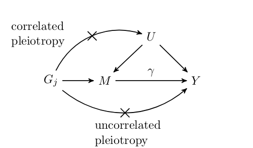

    

        <ul class="nav">
	    <li><a href="#cause"> Mendelian Randomization </a></li>
            <li><a href="#smooth">Spatially Structured Data</a></li>
            <li><a href="#rcc">Confidence Intervals</a></li>
        </ul>
    

###  Mendelian Randomization

Mendelian randomization (MR) is an increasingly popular technique for inferring causal effects between traits that cannot be (or have not been) studied using randomized trials. MR is a variation of instrumental variable analysis in which genetic variants are used as instruments. MR is incredibly appealing because it promises information about causal effects using only summary genetic association data which is now publicly available for a cornucopia of traits. Unfortunately, the assumptions that MR makes about the variants used are quite strict, difficult to verify, and often violated. We developed a Bayesian approach to MR that is robust to a wider range of violations that existing methods. In particular, most existing methods assum that no variants acto on both traits through a common mechanism (we refer to this as correlate pleiotropy). Our proposal, CAUSE, is able to account for a proportion of correlated pleiotropic variants which helps it avoid false positives. 

  

You can read a much longer introduction on the project [website:](https://jean997.github.io/cause/) as well as looking at some results for real traits and walking through a software tutorial.

[R-package](https://github.com/jean997/cause)

[Pre-Print](https://www.biorxiv.org/content/10.1101/682237v3)

### Assocations with spatially structured traits

Sequencing based assays used to measure epigenomic features tend to produce very dense spatially structured measurements like these bisulfite sequencing data from [ENCODE](https://www.encodeproject.org/):

  

We call data generated by these assays "genomic phenotypes".
Often we are interested in identifying regions of the genome where a genomic phenotype is associated with an experimental condition or an organismal level trait (like height). I've worked on two different approaches to this problem. 

In both of these projects, our motivations come from genomic data but there are lots of other spatially structured data types, like time-series or neuroimaging data, that these approaches might be applied to. 

#### Flexible Robust Excursion Test (FRET)

FRET is a method for testing associations with genomic phenotypes that can both adaptively learn the boundaries of associated regions and control the false discovery rate.  FRET is based on the idea of an excursion test in which a test statistics are computed at many closely spaced positions and then smoothed. Associated regions are then identified as regions in which the smoothed test statistic excedes some threshold. This project is in progress!

  

[R-package](https://github.com/jean997/fret)

#### Joint Adaptive Differential Estimation (JADE)

JADE is a graphical/descriptive tool for identifying associations between one spatially structured trait and one categorical trait. We use penalized likelihood to estimate smooth profiles borrowing both across positions and catgories. 

  

[Paper](https://biostatistics.oxfordjournals.org/content/early/2016/08/04/biostatistics.kxw033)

[pdf](papers/jade_main.pdf)/[supplement](papers/jade_supp.pdf)

[R-package](https://github.com/jean997/jadeTF)

### Rank Conditional Coverage

Investigations using "big data" (or even moderate data) often involve computing a large number of estimates for similar parameters. For example, in GWAS, we compute the marginal association of each variant with the trait of interest. The next step is usually to select the parameters with the most significant/largest estimates and try to say something about them. Adjusting significance estimates for multiple comparisons is now common practice. However, it is less common to adjust point estimates and confidence intervals. 
The problem with unadjusted estimates is that the act of selection introduces bias (known as the winner's curse). Parameters with the most significant estimates are more likely to be over-estimates of the true value than under estimates. A particular challenge with adjusting confidence intervals is that it is tricky to define a desirable coverage criterion in a selection setting. We introduced the concept of "rank conditional coverage" (RCC) and a bootstrapping based procedure for constructing intervals that control it. 
The guarantee provided by controlling the RCC at level $\alpha$ is that the top ranked (or rank $j$) parameter will be contained in its confidence interval $1-\alpha$% of the time. We argue that this is an appealing criterion when parameter selection is based on rank. Looking at this criterion reveals a disturbing property of several other confidence intervals, including the unadjusted marginal estimate  --- the top ranked parameter is almost never contained in its corresponding interval!

  

[Paper](https://www.tandfonline.com/doi/abs/10.1080/10618600.2017.1411270)

[pdf](papers/rcc.pdf)

[R-package](https://cran.r-project.org/web/packages/rcc/index.html)

