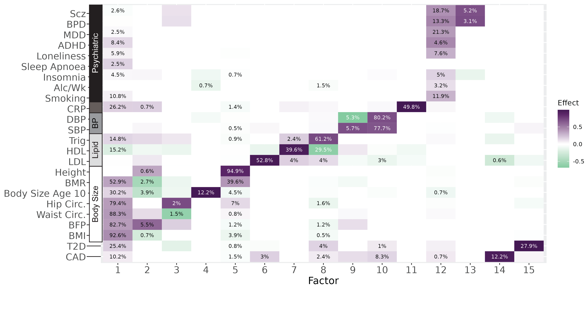
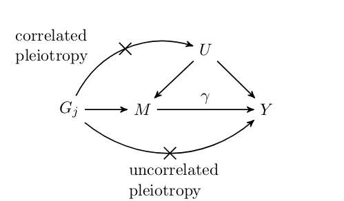
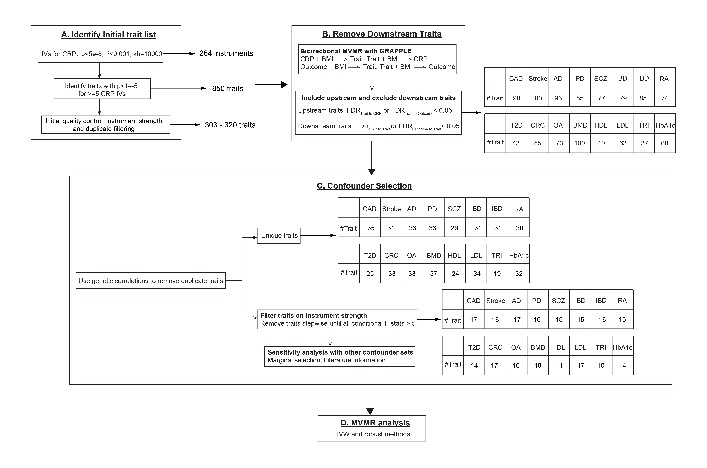
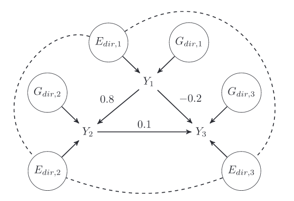

Find my full publication list on my [CV](../assets/cv-jean.pdf) or [Google Scholar](https://scholar.google.com/citations?user=r6fNZ6cAAAAJ).

## Genetic Factor Analysis

<table>
  <tr>
    <td class="left" width="50%">
      

        Genetic factor analysis (GFA) is a matrix decomposition method for GWAS summary statistic data. 
        GFA can be used to decompose the genetic architecture of a large number of traits into contributions from
        latent pleiotropic factors. GFA differs from other factor analysis methods in that 1) it accounts for sample 
        overlap between studies, 2) it does not constrain factors to be orthogonal and 3) it can automatically determine the number
        of factors. 
      

    </td>
    <td class="left">
      
    </td>
  </tr>
</table>

[Paper](https://www.researchsquare.com/article/rs-4714610/v1) |
[Website/Software](https://jean997.github.io/GFA/) |
[Analysis Pipeline](https://github.com/jean997/gfa_pipeline)

## Mendelian Randomization

### Causal Analysis using Summary Effect estimates (CAUSE)

<table>
  <tr>
    <td class="left" width="50%">
      

        CAUSE is a Bayesian Mendelian randomization method that accounts for heritable confounding using a mixture model.  
      

    </td>
    <td class="left">
      
    </td>
  </tr>
 </table>
 
[Paper](https://www.nature.com/articles/s41588-020-0631-4) |
[Website/Software](https://jean997.github.io/cause/) 

### Phenome-Wide Confounder Identification Pipeline (MRScan)

<table>
  <tr>
    <td class="left" width="50%">
      

        An alternative to modeling heritable confounding statistically is to identify and adjust for confounders directly.
We developed a pipeline, MRScan to automatically identify heritable confounders from local sources and from the IEU OpenGWAS database. 
We applied our pipeline to analysis of effects of C-reactive protein on a range of disease outcomes. 
      

    </td>
    <td class="left">
      
    </td>
  </tr>
 </table>

[Paper](https://www.biorxiv.org/content/10.1101/2025.01.08.631816v1) |
[Pipeline](https://github.com/YuxiaoRuoyao/mrScan/tree/master)

### Other MR Papers and Projects

Characterizing the effect of sample mismatch in two-sample MR: [Paper](https://www.medrxiv.org/content/10.1101/2025.07.30.25332465v1)

MR analysis of effects of 1099 metabolites on 2099 disease endpoints: [Paper](https://www.nature.com/articles/s41467-025-58129-2)

MR guidelines paper: [Paper](https://europepmc.org/article/MED/32760811)

## Simulation of GWAS Summary Statistics

<table>
  <tr>
    <td class="left" width="50%">
      

        Evaluation of many statistical genetics methods requires simulation of realistic, genome-wide summary statistics. 
        GWASBrewer efficiently and flexibly simulates GWAS summary statistics for traits with specified causal relationships. 
        GWASBrewer allows specification of genetic architecture, LD structure, trait relationships, and sample overlap. It 
        can be used to generate local or genome-wide data. 
      

    </td>
    <td class="left">
      
    </td>
  </tr>
</table>

[Paper](https://onlinelibrary.wiley.com/doi/10.1002/gepi.22594) |
[Website/Software](https://jean997.github.io/GWASBrewer/)