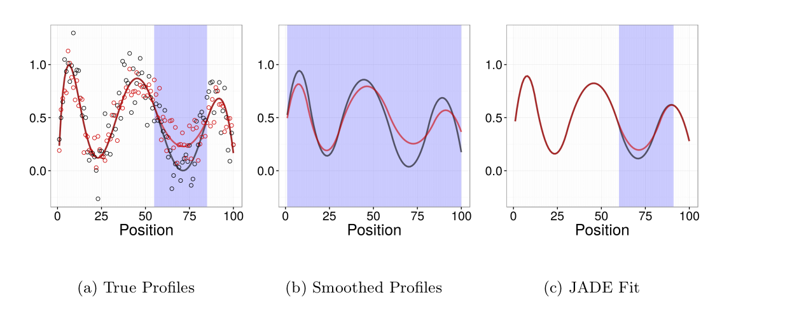

Find my full publication list on my [CV](../assets/cv-jean.pdf) or [Google Scholar](https://scholar.google.com/citations?user=r6fNZ6cAAAAJ).

## Genetic Factor Analysis

<table>
  <tr>
    <td class="left" width="50%">
      

        Genetic factor analysis (GFA) is a matrix decomposition method for GWAS summary statistic data. 
        GFA can be used to decompose the genetic architecture of a large number of traits into contributions from
        latent pleiotropic factors. GFA differs from other factor analysis methods in that 1) it accounts for sample 
        overlap between studies, 2) it does not constrain factors to be orthogonal and 3) it can automatically determine the number
        of factors. 
      

    </td>
    <td class="left">
      
    </td>
  </tr>
</table>

[Paper](https://www.researchsquare.com/article/rs-4714610/v1) |
[Website/Software](https://jean997.github.io/GFA/) |
[Analysis Pipeline](https://github.com/jean997/gfa_pipeline)

## Mendelian Randomization

### Causal Analysis using Summary Effect estimates (CAUSE)

<table>
  <tr>
    <td class="left" width="50%">
      

        CAUSE is a Bayesian Mendelian randomization method that accounts for heritable confounding using a mixture model.  
      

    </td>
    <td class="left">
      
    </td>
  </tr>
 </table>
 
[Paper](https://www.nature.com/articles/s41588-020-0631-4) |
[Website/Software](https://jean997.github.io/cause/) 

### Phenome-Wide Confounder Identification Pipeline (MRScan)

<table>
  <tr>
    <td class="left" width="50%">
      

        An alternative to modeling heritable confounding statistically is to identify and adjust for confounders directly.
We developed a pipeline, MRScan to automatically identify heritable confounders from local sources and from the IEU OpenGWAS database. 
We applied our pipeline to analysis of effects of C-reactive protein on a range of disease outcomes. 
      

    </td>
    <td class="left">
      
    </td>
  </tr>
 </table>

[Paper](https://www.biorxiv.org/content/10.1101/2025.01.08.631816v1) |
[Pipeline](https://github.com/YuxiaoRuoyao/mrScan/tree/master)

### Other MR Papers and Projects

Characterizing the effect of sample mismatch in two-sample MR: [Paper](https://www.medrxiv.org/content/10.1101/2025.07.30.25332465v1)

MR analysis of effects of 1099 metabolites on 2099 disease endpoints: [Paper](https://www.nature.com/articles/s41467-025-58129-2)

MR guidelines paper: [Paper](https://europepmc.org/article/MED/32760811)

## Simulation of GWAS Summary Statistics

<table>
  <tr>
    <td class="left" width="50%">
      

        Evaluation of many statistical genetics methods requires simulation of realistic, genome-wide summary statistics. 
        GWASBrewer efficiently and flexibly simulates GWAS summary statistics for traits with specified causal relationships. 
        GWASBrewer allows specification of genetic architecture, LD structure, trait relationships, and sample overlap. It 
        can be used to generate local or genome-wide data. 
      

    </td>
    <td class="left">
      
    </td>
  </tr>
</table>

[Paper](https://onlinelibrary.wiley.com/doi/10.1002/gepi.22594) |
[Website/Software](https://jean997.github.io/GWASBrewer/)

## Rank Conditional Coverage

Investigations using "big data" (or even moderate data) often involve computing a large number of estimates for similar parameters. 
For example, in GWAS, we compute the marginal association of each variant with the trait of interest. T
he next step is usually to select the parameters with the most significant/largest estimates and try to say something about them. Adjusting significance estimates for multiple comparisons is now common practice. However, it is less common to adjust point estimates and confidence intervals. 
The problem with unadjusted estimates is that the act of selection introduces bias (known as the winner's curse). 
Parameters with the most significant estimates are more likely to be over-estimates of the true value than under estimates. 
A particular challenge with adjusting confidence intervals is that it is tricky to define a desirable coverage criterion in a selection setting. We introduced the concept of "rank conditional coverage" (RCC) and a bootstrapping based procedure for constructing intervals that control it. 
The guarantee provided by controlling the RCC at level &alpha; is that the top ranked (or rank $j$) parameter will be contained in its confidence interval 1-&alpha;% of the time. We argue that this is an appealing criterion when parameter selection is based on rank. Looking at this criterion reveals a disturbing property of several other confidence intervals, including the unadjusted marginal estimate  --- the top ranked parameter is almost never contained in its corresponding interval!

  

[Paper](https://www.tandfonline.com/doi/full/10.1080/10618600.2017.1411270) | [Software](https://github.com/jean997/rcc)

## Assocations with spatially structured traits

Sequencing based assays used to measure epigenomic features tend to produce very dense spatially structured measurements like these bisulfite sequencing data from [ENCODE](https://www.encodeproject.org/):

  

We call data generated by these assays "genomic phenotypes".
Often we are interested in identifying regions of the genome where a genomic phenotype is associated with an experimental condition or an organismal level trait (like height). I've worked on two different approaches to this problem. 

### Flexible Robust Excursion Test (FRET)

FRET is a method for testing associations with genomic phenotypes that can both adaptively learn 
the boundaries of associated regions and control the false discovery rate.  
FRET is based on the idea of an excursion test in which a test statistics are computed at many closely 
spaced positions and then smoothed. Associated regions are then identified as regions in which the smoothed test statistic excedes some threshold. 

  

[R-package](https://github.com/jean997/fret)

### Joint Adaptive Differential Estimation (JADE)

JADE is a graphical/descriptive tool for identifying associations between one spatially structured trait and one categorical trait. We use penalized likelihood to estimate smooth profiles borrowing both across positions and catgories. 

  

[Paper](https://biostatistics.oxfordjournals.org/content/early/2016/08/04/biostatistics.kxw033) |
[R-package](https://github.com/jean997/jadeTF)

